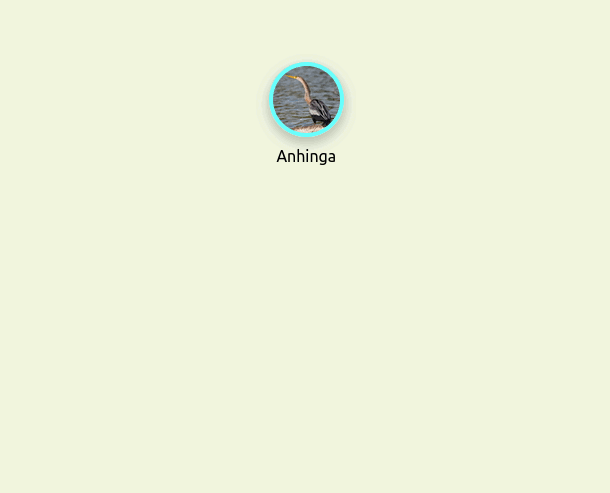

## [Darwin](darwintree.app)
darwintree.app

Darwin is an interactive tool used to explore phylogenetic relationships.

Search for a species of jellyfish, an order of bird, whatever taxa you are interested in.
As different taxa are added, a phylogenetic tree is built by automatically adding
the nodes necessary to connect all of the taxa.

Below is an example tree being built. First, the *Anhinga* taxon is added. Then, then *Double-crested Cormorant*
taxon is added. Their closest common taxon is the *Gannets, Cormorants, and Allies* taxon, so that taxon is automatically
added. Finally, the *Great Cormorant* taxon is added. This taxon shares a common ancestor with the *Double-crested Cormorant*, so
that taxon is added automatically as well.

A tree's URL can be generated for sharing the tree as well, which can also be useful for saving your work
when creating large trees.

