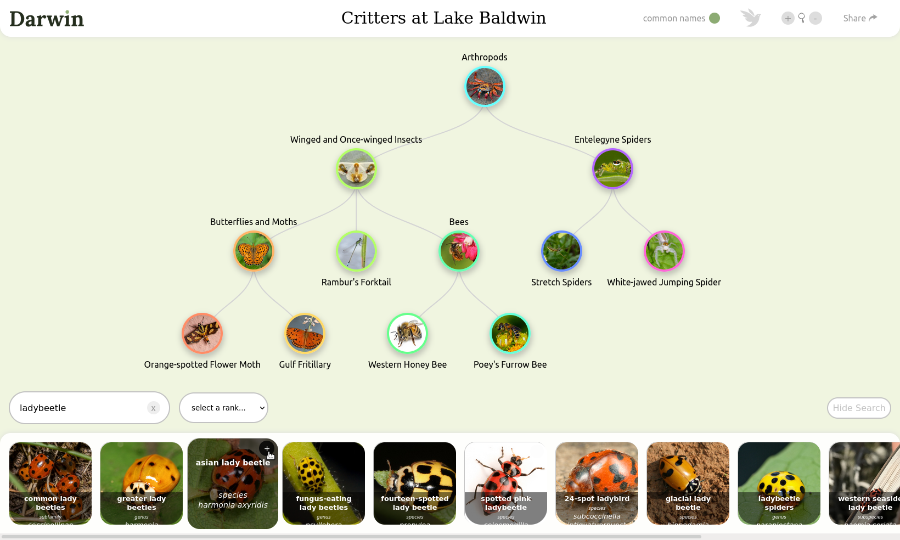

## Darwin

Darwin is an interactive tool used to explore phylogenetic relationships.

Search for a species of jellyfish, an order of bird, whatever taxa you are interested in.
As different taxa are added, a phylogenetic tree is built by automatically adding
the nodes necessary to connect all of the taxa.

A tree's URL can be generated for sharing the tree as well.

