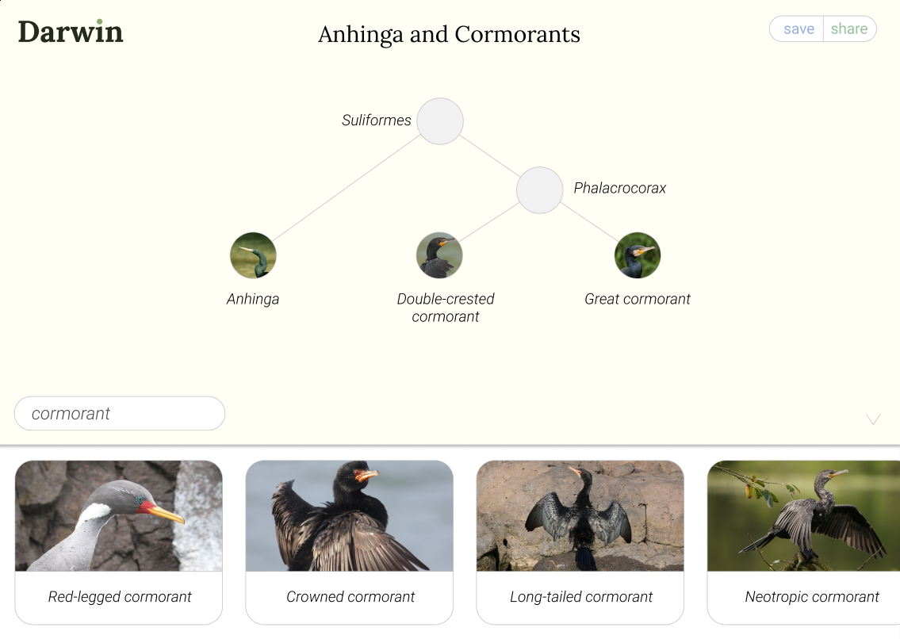

## Darwin

Darwin is an interactive tool used to explore phylogenetic relationships.

Search for a species of jellyfish, an order of bird, whatever taxa you are interested in.
As taxa are added to the canvas, a cladogram is built.

Below is an example tree, where three types of bird have been added. The node for the genus *Phalacrocorax* is generated to connect the two cormorants, and the node for the order *Suliformes* is generated to connect the cormorants to the anhinga.

