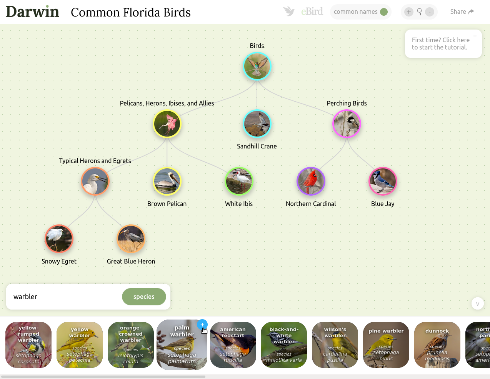

# [Darwin](https://darwintree.app)
darwintree.app

Darwin is an interactive tool used to explore phylogenetic relationships.

[Common Florida Birds](https://darwintree.app/builder/Common_Florida_Birds-1hG-2vpp-1hW-hzM-17O-3-28ak-Yv-2mv-1SX-28J)

